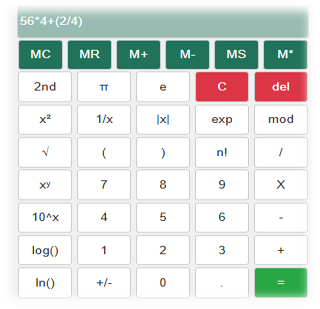

# Basic_Web_Calculator

This repository contains a simple, web-based calculator built with HTML, CSS, and JavaScript. The calculator provides basic arithmetic operations, as well as some scientific functions like square root, exponentials, and logarithms.



## Demo
[You can try out the calculator live here](https://yuvalrozner.github.io/Basic_Web_Calculator/).

## Features
- Basic arithmetic operations: addition, subtraction, multiplication, and division
- Scientific functions: square, square root, logarithmic, exponential, and factorial calculations
- Memory functions: MC (Memory Clear), MR (Memory Recall), M+ (Memory Add), M- (Memory Subtract), MS (Memory Store), and M* (Memory Multiply)
- Special constants and functions, including π (Pi) and e (Euler's number)
- Clear (`C`) and Delete (`del`) options for error correction
- Modular division function for integer division

## Screenshot
The following image shows the layout of the calculator:

## Installation
Clone the repository to your local machine:
```bash
git clone https://github.com/your_username/Basic_Web_Calculator.git
